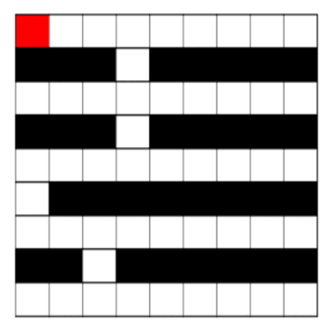

# Path-Viz



This demonstrates the Reinforcemnet learning agent for a maze visualization using Python's Turtle graphics library.
- It creates a grid layout representing a maze, places a start point and a destination point, and visually illustrates the process of finding the optimal path from the start to the destination.

## Features

- Visualization of Reinforcement learning agent.
- Visual representation of a maze in a grid layout.
- Start and destination points are clearly marked.
- Interactive visualization using Python's Turtle graphics.

## Dependencies

To run it, you need to have the following dependencies installed:

- Python 3.x
- Turtle graphics library (included with standard Python installations)

```bash
pip install PythonTurtle
```

## Usage

Clone the repository:
```bash
git clone https://github.com/montux4yt/path-viz.git
```

Navigate to the directory:
```bash
cd path-viz
```

run the command:
```bash
python path-viz.py
```
This will launch the Turtle graphics window, where you can see the maze and the pathfinding process in action.

## Contributing

Contributions are welcome! If you have suggestions for improvements or new features, feel free to open an issue or submit a pull request.

## License

This project is licensed under the MIT License. See the [LICENSE](LICENSE) file for more details.
